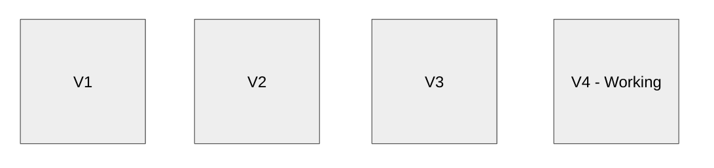
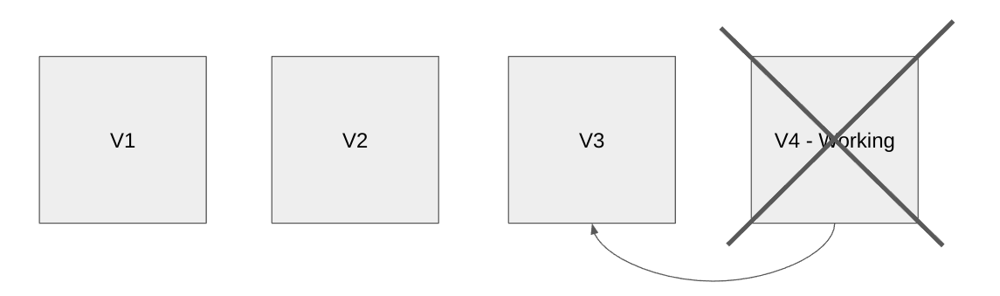

# 1 Introduction to git

## Objectives

1. To be able to keep a log of all of your versions (or changes) of your work.
   The figure represents how your work develops from version 1 to 2, to 3 and
   so on.

   
1. To be able to discard your working changes back to the latest version or
   commit.

   
1. To avoid manually keeping copies of each version, unlike the figure below,
   but still be able to view the files from each version.

   

## Prerequisites

- Install [git](https://git-scm.com/downloads)
- To be able to use Powershell (Windows) or the terminal (Mac/Linux) with the
  following commands:
  - `pwd` (print working directory)
  - `ls` (list directory contents)
  - `cd` (change directory, eg `cd ..` and `cd [FOLDER NAME]`)

## Verify you have git

In the terminal, type in `git` or `git --version` and push enter. It should show
some text without any error messages.

## Setting up git

Set up `git` on your computer by providing a user name (for example for GitHub)
and an email address:

```shell
git config --global user.name [USER NAME]
git config --global user.email [USER EMAIL]
```

Verify these user settings using

```shell
git config --global -l
```

You will only need to do this once.

## Making a git repository

In the current working directory you would like to make into a git repository,
use

```shell
git init
```

You will only need to do this once for each repository.

## Making your first commit

To add a file to the stage

```shell
git add [FILE NAME]
```

To verify that the files you want are staged

```shell
git status
```

To commit those staged files with a meaningful message or description

```shell
git commit -m "[MESSAGE]`
```

To verify those changes are committed

```shell
git log
```

and you should see your user name, user email and your commit message.

## Committing more changes

To see which files are modified or new (untracked)

```shell
git status
```

For example

```plaintext
Changes not staged for commit:
  (use "git add <file>..." to update what will be committed)
  (use "git restore <file>..." to discard changes in working directory)
  modified:   README.md

no changes added to commit (use "git add" and/or "git commit -a")
```

shows that the file `README.md` has been modified.

To add those changes to the stage

```shell
git add [FILE NAME]
```

To verify that the files you want are staged

```shell
git status
```

For example

```plaintext
On branch master
Changes to be committed:
  (use "git restore --staged <file>..." to unstage)
  modified:   README.md
```

shows that the file `README.md` has been successfully added to the stage. On
most terminals, the colour of the file name will change from red to green.

To commit those staged files with a meaningful message or description

```shell
git commit -m "[MESSAGE]`
```

To verify those changes are committed

```shell
git log
```

and you should see your additional commit.

This meets objective 1.

## Restore to your latest commit

You may want to discard your working changes back to your latest commit.

Verify which files have been modified using

```shell
git status
```

To discard your working changes, use

```shell
git restore [FILE]
```

In older versions of git, you may have to use `git checkout [FILE]` instead.

This is destructive, you won't get your changes back.

This meets objective 2.

### Stashing

Another option is to stash *all* of your changes using

```shell
git stash
```

If you then change your mind and want your changes back, use

```shell
git stash pop
```

## Checkout your previous commits

Use `git log` to view all of your commits. To view your repository one commit
before, use

```shell
git checkout HEAD~1
```

and use `git log` again to verify that there is one less commit. You may look
around and make experimental changes. You may also use `git checkout HEAD~1`
again or even `git checkout HEAD~2`.

To get back to your latest commit, use

```shell
git checkout master
```

or `git checkout main` if that doesn't work, depending on the name of your
default branch.

This meets objective 3.

### Hashes

For much larger histories, you may use the hash to checkout directly to a commit
you have an interest in. Use `git log` to view past commits, for example,

```plaintext
commit 9ee11c6144cf35c4ff743bebadd5067bcc1ecee7 (HEAD -> master)
Author: aax270 <s.lo@qmul.ac.uk>
Date:   Tue Apr 18 11:24:06 2023 +0000

    Add appendix

commit 4d5988d2456a1fb62be4130bed944944e4138422
Author: aax270 <s.lo@qmul.ac.uk>
Date:   Tue Apr 18 11:22:22 2023 +0000

    Add a greeting to README

commit 54efeb11ac22894218c4b01b5f7627dd45099eab
Author: aax270 <s.lo@qmul.ac.uk>
Date:   Tue Apr 18 11:17:26 2023 +0000

    This is my first commit
```

The letters and numbers after the word `commit`, for example `54efeb11,` is
called a hash and is used to identify each commit. I recommend using the first
7 symbols.

To checkout to a commit given its hash, use

```shell
git checkout [HASH]
```

for example `git checkout 54efeb11`.

To get back to your latest commit, use

```shell
git checkout master
```

## Final remarks

- Use `git status` and `git log` to check where you have left off. They are very
  safe commands. It should give you clues if you have been checking out commits
  or made some changes.
- Is it better to have more or fewer commits? Your commits should be meaningful
  and have a justification to be their own commit. It will affect what your
  history will look like when using `git log`. An analogy would be setting
  out chapters in a book.
